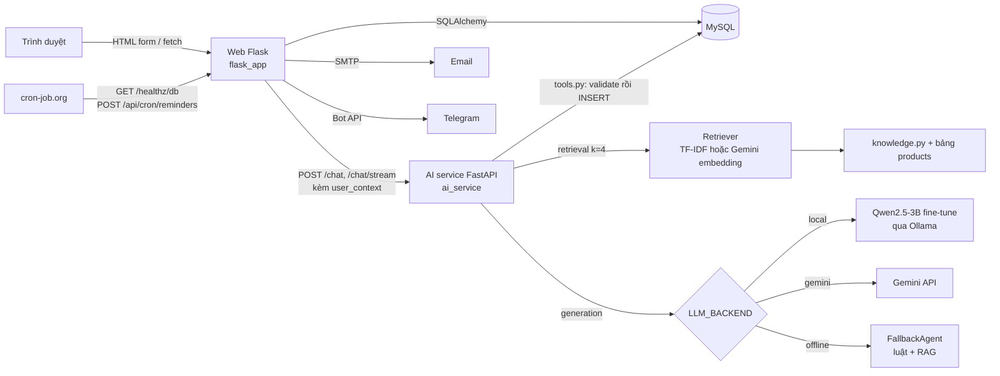

# NALI Dental Clinic

[](flask_app/Dockerfile)
[](https://github.com/MinhNhat-2504/NaLi-Dental-Clinic-Web/actions/workflows/ci.yml)

Website đặt lịch cho phòng khám nha khoa, kèm chatbot RAG tư vấn và tự ghi lịch hẹn vào database.

Demo: https://nali-dental-web.onrender.com (gói free, lần mở đầu có thể chờ 30 giây).

## Demo

[CẦN BỔ SUNG: ảnh chụp trang Dịch vụ, trang đặt lịch và widget chatbot. Repo hiện chưa có ảnh chụp màn hình.]

Ví dụ hỏi đáp thật của chatbot ở chế độ offline (không cần API key, lấy từ `ai_service/fallback_agent.py`):

```
Người dùng: Phòng khám mở cửa mấy giờ?

Bot: Dạ NALI xin thông tin ạ:
• Giờ làm việc: NALI Dental mở cửa tất cả các ngày trong tuần, từ Thứ 2 đến Chủ Nhật,
  khung giờ 08:00 đến 20:00.
• Quy trình đặt lịch: Khách chỉ cần cung cấp họ tên, số điện thoại, chọn ngày và giờ
  mong muốn. Lễ tân sẽ gọi xác nhận trước buổi hẹn.
• Bãi đỗ xe và tiện ích: Cả 3 chi nhánh NALI đều có chỗ để xe máy miễn phí cho khách...
```

Gọi API trực tiếp:

```bash
curl -X POST https://nali-dental-ai.onrender.com/chat \
  -H "Content-Type: application/json" \
  -d '{"session_id": "demo", "message": "Tẩy trắng răng giá bao nhiêu?"}'
# {"reply": "...", "mode": "gemini"}
```

## Bài toán

Phòng khám nhỏ nhận lịch qua điện thoại và ghi tay, nên khách chỉ đặt được trong giờ làm việc, lễ tân
phải trả lời lặp lại các câu về giá, giờ mở cửa, địa chỉ, và không có cơ chế nhắc lịch nên tỷ lệ khách
quên hẹn cao. Dự án thay phần đó bằng web đặt lịch tự phục vụ, email nhắc lịch tự động, và một chatbot
trả lời từ dữ liệu thật của phòng khám rồi tự tạo lịch hẹn. Yêu cầu đặt ra: chatbot không được bịa giá
hay thông tin, việc ghi lịch phải đúng tuyệt đối, và toàn bộ chạy được với chi phí 0 đồng.

## Kiến trúc



- **Web Flask** (`flask_app/`): giao diện khách và trang quản trị, đặt lịch, đặt cọc VietQR, hồ sơ khám,
  thư viện ca, email, Telegram. Là nơi duy nhất render HTML và giữ session đăng nhập. Khi gọi chatbot, web
  dựng chuỗi `user_context` (tên, SĐT, lịch sắp tới, hồ sơ gần nhất) gửi kèm để bot nhớ khách.
- **AI service FastAPI** (`ai_service/`): tách tiến trình riêng để lỗi hoặc độ trễ của LLM không kéo web
  theo, và để đổi backend LLM bằng một biến môi trường. Endpoint: `/chat`, `/chat/stream` (SSE),
  `/analyze-image`, `/reset`, `/health`.
- **Retrieval**: `retriever.py` chọn Gemini `text-embedding-004` khi có key, không thì TF-IDF (scikit-learn).
  Corpus gồm 10 tài liệu cố định trong `knowledge.py` (giờ làm việc, chi nhánh, thanh toán, phạm vi thông tin)
  cộng bảng dịch vụ đọc từ MySQL. Câu hỏi và tài liệu đều được bỏ dấu trước khi so khớp.
- **Generation**: `_select_primary()` trong `main.py` chọn theo `LLM_BACKEND=auto|local|gemini|offline`,
  thứ tự ưu tiên local, gemini, offline. Mỗi lượt gọi LLM thất bại thì rơi về `FallbackAgent`.
- **Code kiểm soát (guardrail)**:
  - Ý định đặt lịch ở backend local được nhận diện bằng từ khoá và chuyển sang máy trạng thái
    slot-filling trong `FallbackAgent` (tên, SĐT, ngày, giờ), LLM không tham gia bước này.
  - Backend Gemini dùng function calling với 3 tool `tim_dich_vu`, `kiem_tra_lich_trong`, `dat_lich_hen`;
    backend local dùng giao thức JSON tự cài (`{"tool": ..., "args": ...}`), tối đa 4 vòng, tool lạ bị từ chối.
  - LLM không ghi thẳng vào database. Mọi đường đều đi qua `tools.dat_lich_hen()`: validate SĐT, ngày, giờ,
    giờ mở cửa, kiểm tra trùng slot, rồi mới INSERT.
  - Câu hỏi về hồ sơ, dặn dò, tái khám được trả lời trực tiếp từ `user_context`
    (`FallbackAgent.record_answer`) ở mọi backend, không qua LLM.
- **Vision**: `/analyze-image` gửi ảnh sang Gemini, yêu cầu JSON có cấu trúc, ghép với bảng dịch vụ để gợi ý,
  luôn kèm câu miễn trừ trách nhiệm.
- **Cron**: cron-job.org gọi `/healthz/db` mỗi 10 phút (giữ Render free thức và tạo hoạt động để MySQL free
  của Aiven không tự tắt) và `/api/cron/reminders` lúc 08:00 với header `X-Cron-Token`.

## Công nghệ sử dụng

| Tầng | Công nghệ | Vì sao chọn |
|---|---|---|
| Data | 110 mẫu SFT tự sinh (`finetune/generate_dataset.py`) | Phòng khám không có log hội thoại; script ghép dữ liệu thật trong DB (dịch vụ, giá, giờ) vào mẫu hội thoại, gồm hỏi đáp theo ngữ cảnh, đặt lịch nhiều lượt và mẫu gọi tool JSON |
| Data | `knowledge.py` 10 tài liệu cố định + bảng `products` | Dữ kiện đổi thường xuyên (giá) phải lấy từ DB lúc chạy, không đưa vào trọng số model |
| Model | Qwen2.5-3B-Instruct + QLoRA (r=16, alpha=32, 4-bit, 3 epoch) | Comment trong `train_qlora.py`: batch 1 và gradient accumulation 8 để vừa GPU 8GB (RTX 4060 Laptop); fine-tune chỉ để chỉnh giọng và hành vi gọi tool |
| Model | Ollama, giao thức OpenAI-compatible | Docstring `local_llm_agent.py`: đổi được sang llama.cpp, vLLM, TGI mà không sửa code |
| Model | Gemini (`gemini-3.6-flash`, `text-embedding-004`) | Render free không đủ RAM chạy model local; Gemini có free tier, có function calling và vision |
| Model | TF-IDF (scikit-learn) | Comment trong requirements: RAG chạy offline không cần mạng, corpus nhỏ nên đủ dùng |
| Serving | Flask 3.1, app factory + 5 blueprint | Yêu cầu môn học là Flask; app factory cho phép tạo app với config test riêng |
| Serving | Flask-WTF, Flask-Login, Flask-Mail, Flask-Migrate | CSRF và validate form; hai loại user (bệnh nhân, nhân viên) qua id có tiền tố `p:`/`s:`; email; migration có version |
| Serving | FastAPI 0.115 + uvicorn + pydantic | Comment trong requirements: async hợp với request chờ LLM lâu, schema vào ra có kiểm tra kiểu |
| Serving | gunicorn `-w 2 -k gthread --threads 4` | Lấy từ `render.yaml`; gthread để mỗi worker phục vụ nhiều request chờ I/O |
| Storage | MySQL 8 (XAMPP local, Aiven free production) | [CẦN BỔ SUNG: lý do chọn MySQL thay vì PostgreSQL; hiện DB kế thừa từ bản PHP cũ nên có cột ngoài model] |
| Storage | PyMySQL (web) và mysql-connector-python (AI) | mysql-connector: comment "pure Python" trong requirements. [CẦN BỔ SUNG: lý do web dùng PyMySQL thay vì dùng chung một driver] |
| Storage | Ảnh ca điều trị lưu BLOB trong MySQL, nén bằng Pillow | Docstring `models.CaseStudy`: ổ đĩa Render free bị xoá mỗi lần deploy; Pillow thu nhỏ 1200px và bỏ EXIF |
| Storage | bcrypt, itsdangerous | Hash mật khẩu; token đặt lại mật khẩu có hạn 30 phút, gắn 12 ký tự cuối của hash để link cũ tự vô hiệu |
| Infra | Render Blueprint (`render.yaml`), Aiven | Hai web service free và MySQL free, tổng chi phí 0 đồng |
| Infra | cron-job.org | Ghi chú trong `DEPLOY_FREE.md`: cron của GitHub Actions bị trễ 4 giờ và bỏ lượt nên thay |
| Infra | Docker Compose + nginx + certbot | Phương án VPS riêng có HTTPS (`docker-compose.prod.yml`) |
| Infra | Cache và rate limit trong tiến trình (`cache.py`, `ratelimit.py`) | Docstring: DB cloud xa nên cache 60 giây; không cần Redis ở quy mô phòng khám |
| Testing | pytest với SQLite in-memory | Comment `conftest.py`: tách khỏi MySQL thật, `AI_SERVICE_URL` trỏ cổng chết để test không phụ thuộc service ngoài |
| Testing | `test_agent.py`, `eval_agent.py` | Test AI chạy offline không cần key; eval 30 câu chấm tự động, CI fail nếu dưới 80% |
| Testing | GitHub Actions | Chạy pytest và test AI mỗi lần push |

## Cách chạy

Yêu cầu: Python 3.11, MySQL 8 (XAMPP hoặc Docker). Ollama chỉ cần khi muốn dùng model local.

```bash
git clone https://github.com/MinhNhat-2504/NaLi-Dental-Clinic-Web.git
cd NaLi-Dental-Clinic-Web
```

Web:

```bash
cd flask_app
pip install -r requirements.txt
cp .env.example .env            # điền DB_PASS
flask --app run.py init-db      # DB mới: tạo bảng theo model
flask --app run.py db stamp head
INITIAL_ADMIN_PASSWORD=<mat-khau> flask --app run.py seed-db
flask --app run.py seed-content # FAQ, bài viết
flask --app run.py seed-cases   # 1 ca trước/sau demo
python run.py                   # http://127.0.0.1:5000
```

DB đã có sẵn từ trước thì thay `init-db` + `stamp head` bằng `flask --app run.py db upgrade`.

AI service:

```bash
cd ai_service
pip install -r requirements.txt
cp .env.example .env            # tuỳ chọn: GEMINI_API_KEY, LLM_BACKEND
python main.py                  # http://127.0.0.1:8000, docs tại /docs
```

Không có key và không có Ollama thì service chạy `offline`, vẫn tư vấn và đặt lịch được.

Model weights: adapter LoRA và GGUF không có trong repo. Train lại bằng
`ai_service/finetune/train_qlora.py` rồi `merge_and_export.py`, nạp vào Ollama theo
`ai_service/finetune/README.md`. Cần GPU 8GB trở lên.

Biến môi trường (tên biến, không có giá trị trong repo):

- Web: `DATABASE_URL` hoặc `DB_HOST/DB_PORT/DB_USER/DB_PASS/DB_NAME`, `SECRET_KEY`, `APP_ENV`,
  `AI_SERVICE_URL`, `MAIL_SERVER/MAIL_PORT/MAIL_USERNAME/MAIL_PASSWORD/MAIL_DEFAULT_SENDER`, `CRON_TOKEN`,
  `BANK_ID/BANK_ACCOUNT_NO/BANK_ACCOUNT_NAME/DEPOSIT_AMOUNT`, `TELEGRAM_BOT_TOKEN/TELEGRAM_CHAT_ID`,
  `REVISIT_REMIND_DAYS`, `CHAT_RATE_LIMIT`, `GA_MEASUREMENT_ID`, `GOOGLE_SITE_VERIFICATION`,
  `SITE_URL`, `TIMEZONE`, `PER_PAGE`, `AUTO_CREATE_SCHEMA`.
- AI: `LLM_BACKEND`, `LOCAL_LLM_URL/LOCAL_LLM_MODEL/LOCAL_LLM_KEY`, `GEMINI_API_KEY`, `GEMINI_MODEL`,
  `DATABASE_URL` hoặc `DB_HOST/DB_PORT/DB_USER/DB_PASSWORD/DB_NAME`, `HOST`, `PORT`.

Test:

```bash
cd flask_app && pytest -q                                  # 34 test
cd ai_service && LLM_BACKEND=offline python test_agent.py  # 33 kiểm tra
cd ai_service && python eval_agent.py --min 80             # eval 30 câu
```

Deploy miễn phí theo `DEPLOY_FREE.md`, VPS theo `DEPLOY.md`.

## Kết quả và đánh giá

Số liệu lấy từ `ai_service/eval/last_result.json` (chạy `eval_agent.py`, backend `offline`):

| Chỉ số | Giá trị | Cách đo |
|---|---|---|
| Câu trả lời đạt | 25/25 (100%) | 30 câu trong `eval/questions.json` theo 12 chủ đề; câu đạt khi chứa ít nhất 1 từ khoá mong đợi, so sánh không dấu |
| Câu bị bỏ qua | 5 | Cần MySQL (hỏi giá dịch vụ), tự skip khi chạy offline không có DB |
| Độ trễ trung bình | 494 ms | Đo trong tiến trình, backend offline, không tính mạng |

Cách chấm bằng từ khoá chỉ bắt được câu trả lời sai hẳn, không đo được câu đúng từ khoá nhưng diễn giải sai.
Chưa có kết quả eval cho backend `gemini` và `local` lưu trong repo.
[CẦN BỔ SUNG: chạy `LLM_BACKEND=gemini python eval_agent.py` và ghi lại score, avg_ms.]

Kiểm thử: 34 test pytest (đăng nhập, phân trang, đặt lịch, trùng slot, phân quyền, chat log, nhắc lịch, hồ sơ,
đặt cọc, upload ca, GA4, khoá đăng nhập, rate limit, streaming, healthz) và 33 kiểm tra AI offline
(parse ngày giờ tiếng Việt, tìm dịch vụ, retriever, luồng đặt lịch, hồ sơ, parse tool JSON).

Fine-tune: [CẦN BỔ SUNG: loss cuối, thời gian train, và so sánh trước/sau fine-tune trên bộ eval. Repo chỉ có
checkpoint cấu hình, không có log train.]

## Các quyết định thiết kế chính

- **Quyết định**: tách AI thành service FastAPI riêng thay vì gọi LLM trong Flask.
  **Vì**: LLM chậm và hay lỗi; web đặt lịch phải sống độc lập, và cần đổi backend bằng config.
  **Đánh đổi**: thêm một hop mạng và một tiến trình phải deploy, giữ thức, cấu hình DB hai nơi.

- **Quyết định**: ở backend local, đặt lịch đi qua máy trạng thái slot-filling thay vì để model gọi tool.
  **Vì**: model 3B hay hiểu sai ngày giờ; ghi sai lịch là lỗi không chấp nhận được.
  **Đánh đổi**: hai backend hành xử khác nhau (Gemini vẫn dùng function calling), hội thoại đặt lịch ở
  local cứng nhắc hơn.

- **Quyết định**: fine-tune chỉ cho giọng và hành vi, dữ kiện lấy bằng RAG.
  **Vì**: giá dịch vụ thay đổi thì không thể train lại; admin sửa DB là bot trả lời theo ngay.
  **Đánh đổi**: chất lượng trả lời phụ thuộc retriever; TF-IDF trên corpus nhỏ dễ lấy nhầm tài liệu.

- **Quyết định**: migration Alembic viết tay, idempotent, thay vì autogenerate.
  **Vì**: DB kế thừa từ bản PHP có cột ngoài model; autogenerate từng sinh lệnh xoá cột.
  **Đánh đổi**: thêm bảng hay cột phải tự viết, dễ quên đồng bộ với model.

- **Quyết định**: lưu ảnh ca điều trị dạng BLOB trong MySQL thay vì object storage.
  **Vì**: Render free xoá ổ đĩa khi deploy; Aiven cho 5GB; ràng buộc chi phí 0 đồng.
  **Đánh đổi**: DB phình theo ảnh, mỗi lần đọc ảnh tốn một query, không có CDN.

## Hạn chế và việc làm tiếp

Hạn chế:

1. Eval chấm bằng từ khoá, không phát hiện câu trả lời đúng từ khoá nhưng sai nghĩa; 5/30 câu bị bỏ khi
   không có DB; chưa có số đo cho backend Gemini và local.
2. Không có test cho `analyze_dental_image` (vision) và cho streaming với LLM thật; toàn bộ test AI chạy
   offline nên không bắt được lỗi prompt hay tool-calling của model.
3. `cache.py` và `ratelimit.py` giữ state trong tiến trình; gunicorn chạy 2 worker nên giới hạn thực tế
   gấp đôi con số cấu hình và cache có thể lệch giữa hai worker.
4. Đặt lịch không có unique index hay `SELECT ... FOR UPDATE` trên (ngày, giờ); hai request cùng lúc có
   thể ghi trùng slot. Test hiện chỉ kiểm tra tuần tự.
5. Hotline và địa chỉ chi nhánh hardcode trong 8 file và trong `knowledge.py`, không lấy từ DB hay config.
6. Hai backend xử lý đặt lịch khác nhau: Gemini để model tự điền tham số tool (chỉ validate ở `tools.py`),
   local đi qua slot-filling. Cùng một câu có thể cho hành vi khác nhau tuỳ backend.
7. Model fine-tune không chạy trên production vì Render free không đủ RAM; bản demo dùng Gemini nên phần
   fine-tune chưa được kiểm chứng với người dùng thật.
8. `/api/chat` tắt CSRF (cần cho fetch từ widget) và chỉ chặn bằng rate limit theo IP.

Việc làm tiếp, theo ưu tiên:

1. Đổi eval sang chấm bằng LLM-as-judge hoặc so khớp ngữ nghĩa, chạy thêm trên backend Gemini trong CI với
   secret, lưu kết quả theo từng commit.
2. Thêm unique index `(appointment_date, appointment_time)` hoặc khoá hàng khi đặt lịch; chuyển cache và
   rate limit sang Redis khi chạy nhiều worker.
3. Thống nhất luồng đặt lịch giữa hai backend (Gemini cũng đi qua slot-filling), đưa hotline và chi nhánh
   vào bảng cấu hình trong DB.

## Cấu trúc thư mục

```
flask_app/                  web Flask
  app/
    __init__.py             app factory, lệnh CLI (init-db, seed-*, send-reminders)
    models.py               Patient, Staff, Product, Appointment, Feedback, FAQ, BlogPost,
                            ChatLog, MedicalRecord, CaseStudy
    main.py                 trang công khai, /healthz, /healthz/db, sitemap
    auth.py                 đăng nhập, đăng ký, đổi/quên mật khẩu, khoá đăng nhập
    booking.py              đặt lịch, đổi/huỷ, đặt cọc VietQR, hồ sơ khám của tôi
    admin.py                quản trị, hồ sơ bệnh nhân, ca điều trị, chất lượng AI
    api.py                  proxy /api/chat và /api/chat/stream, /api/cron/reminders
    reminders.py            email nhắc lịch 24h và nhắc tái khám
    notify.py               Telegram
    cache.py, ratelimit.py  state trong tiến trình
    imaging.py              nén ảnh, bỏ EXIF
  migrations/versions/      6 migration viết tay
  tests/                    34 test pytest
ai_service/                 FastAPI
  main.py                   endpoint, chọn backend, fallback
  retriever.py              TF-IDF hoặc Gemini embedding, bỏ dấu
  knowledge.py              10 tài liệu cố định
  tools.py                  tim_dich_vu, kiem_tra_lich_trong, dat_lich_hen (validate + INSERT)
  fallback_agent.py         agent luật: slot-filling đặt lịch, trả lời hồ sơ
  local_llm_agent.py        Qwen qua Ollama, tool-calling JSON
  gemini_agent.py           Gemini function calling
  vision_agent.py           phân tích ảnh răng
  eval_agent.py, eval/      30 câu eval và kết quả gần nhất
  test_agent.py             33 kiểm tra offline
  finetune/                 generate_dataset.py, train_qlora.py, merge_and_export.py, data/nali_sft.jsonl
.github/workflows/ci.yml    pytest + test AI mỗi lần push
render.yaml                 2 web service free trên Render
docker-compose.prod.yml     MySQL + gunicorn + nginx + certbot cho VPS
deploy/                     nginx template, entrypoint, HuggingFace Space
DEPLOY_FREE.md, DEPLOY.md   hướng dẫn triển khai
```

## Ghi nhận và giấy phép

- Model gốc: Qwen2.5-3B-Instruct (Alibaba Cloud, Apache 2.0). Fine-tune bằng transformers, peft, bitsandbytes.
- Gemini API (chat, embedding, vision), Open-Meteo (thời tiết), VietQR (`img.vietqr.io`, tạo QR chuyển khoản),
  Telegram Bot API.
- Dataset huấn luyện 110 mẫu tự sinh từ dữ liệu của dự án, không dùng dataset ngoài.
- Ảnh minh hoạ dịch vụ và ca điều trị là ảnh minh hoạ, có ghi nhãn trên web.
- License: [CẦN BỔ SUNG: repo chưa có file LICENSE. Gợi ý MIT nếu muốn cho phép dùng lại.]

Trịnh Ngọc Minh Nhật
