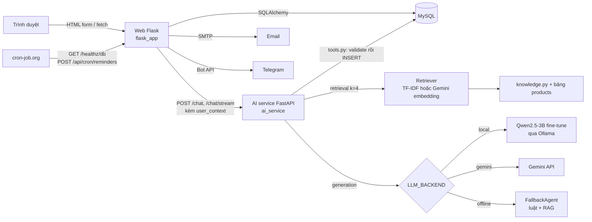

# NALI Dental Clinic

[](flask_app/Dockerfile)
[](https://github.com/MinhNhat-2504/NaLi-Dental-Clinic-Web/actions/workflows/ci.yml)

Website đặt lịch cho phòng khám nha khoa, kèm chatbot RAG tư vấn và tự ghi lịch hẹn vào database.

Demo: https://nali-dental-web.onrender.com (gói free, lần mở đầu có thể chờ 30 giây).

## Demo

Ví dụ hỏi đáp thật của chatbot ở chế độ offline (không cần API key, lấy từ `ai_service/fallback_agent.py`):

```
Người dùng: Phòng khám mở cửa mấy giờ?

Bot: Dạ NALI xin thông tin ạ:
• Giờ làm việc: NALI Dental mở cửa tất cả các ngày trong tuần, từ Thứ 2 đến Chủ Nhật,
  khung giờ 08:00 đến 20:00.
• Quy trình đặt lịch: Khách chỉ cần cung cấp họ tên, số điện thoại, chọn ngày và giờ
  mong muốn. Lễ tân sẽ gọi xác nhận trước buổi hẹn.
• Bãi đỗ xe và tiện ích: Cả 3 chi nhánh NALI đều có chỗ để xe máy miễn phí cho khách...
```

Gọi API trực tiếp:

```bash
curl -X POST https://nali-dental-ai.onrender.com/chat \
  -H "Content-Type: application/json" \
  -d '{"session_id": "demo", "message": "Tẩy trắng răng giá bao nhiêu?"}'
# {"reply": "...", "mode": "gemini"}
```

## Bài toán

Phòng khám nhỏ nhận lịch qua điện thoại và ghi tay, nên khách chỉ đặt được trong giờ làm việc, lễ tân
phải trả lời lặp lại các câu về giá, giờ mở cửa, địa chỉ, và không có cơ chế nhắc lịch nên tỷ lệ khách
quên hẹn cao. Dự án thay phần đó bằng web đặt lịch tự phục vụ, email nhắc lịch tự động, và một chatbot
trả lời từ dữ liệu thật của phòng khám rồi tự tạo lịch hẹn. Yêu cầu đặt ra: chatbot không được bịa giá
hay thông tin, việc ghi lịch phải đúng tuyệt đối, và toàn bộ chạy được với chi phí 0 đồng.

## Kiến trúc



- **Web Flask** (`flask_app/`): giao diện khách và trang quản trị, đặt lịch, đặt cọc VietQR, hồ sơ khám,
  thư viện ca, email, Telegram. Là nơi duy nhất render HTML và giữ session đăng nhập. Khi gọi chatbot, web
  dựng chuỗi `user_context` (tên, SĐT, lịch sắp tới, hồ sơ gần nhất) gửi kèm để bot nhớ khách.
  Thông tin phòng khám (hotline, email, giờ, chi nhánh) nằm trong bảng `clinic_settings`, admin sửa ở
  `/admin/cai-dat`; web, email và AI service cùng đọc, lưu xong web gọi `POST /reload` để AI nạp lại.
- **AI service FastAPI** (`ai_service/`): tách tiến trình riêng để lỗi hoặc độ trễ của LLM không kéo web
  theo, và để đổi backend LLM bằng một biến môi trường. Endpoint: `/chat`, `/chat/stream` (SSE),
  `/analyze-image`, `/reset`, `/health`.
- **Retrieval**: `retriever.py` chọn Gemini `text-embedding-004` khi có key, không thì TF-IDF (scikit-learn).
  Corpus gồm 10 tài liệu cố định trong `knowledge.py` (giờ làm việc, chi nhánh, thanh toán, phạm vi thông tin)
  cộng bảng dịch vụ đọc từ MySQL. Câu hỏi và tài liệu đều được bỏ dấu trước khi so khớp.
- **Generation**: `_select_primary()` trong `main.py` chọn theo `LLM_BACKEND=auto|local|gemini|offline`,
  thứ tự ưu tiên local, gemini, offline. Mỗi lượt gọi LLM thất bại thì rơi về `FallbackAgent`.
- **Code kiểm soát (guardrail)**:
  - Ý định đặt lịch (`wants_booking`) được nhận diện bằng từ khoá ở cả hai backend local và Gemini, rồi
    chuyển sang máy trạng thái slot-filling trong `FallbackAgent` (tên, SĐT, ngày, giờ). LLM không tham gia
    bước này và không có tool ghi lịch: Gemini chỉ có `tim_dich_vu`, `kiem_tra_lich_trong` qua function
    calling; local dùng giao thức JSON tự cài (`{"tool": ..., "args": ...}`), tối đa 4 vòng, tool lạ bị từ chối.
  - Ghi lịch chỉ đi qua `tools.dat_lich_hen()`: validate SĐT, ngày, giờ, giờ mở cửa, kiểm tra trùng slot rồi
    INSERT. Tầng DB có thêm cột `slot_key` ("YYYY-MM-DD HH:MM" khi lịch còn hiệu lực) với UNIQUE index, nên hai
    request đặt cùng slot trong cùng lúc thì một cái bị từ chối ở MySQL, code bắt `IntegrityError` và báo khách.
  - Câu hỏi về hồ sơ, dặn dò, tái khám được trả lời trực tiếp từ `user_context`
    (`FallbackAgent.record_answer`) ở mọi backend, không qua LLM.
- **Vision**: `/analyze-image` gửi ảnh sang Gemini, yêu cầu JSON có cấu trúc, ghép với bảng dịch vụ để gợi ý,
  luôn kèm câu miễn trừ trách nhiệm.
- **Cron**: cron-job.org gọi `/healthz/db` mỗi 10 phút (giữ Render free thức và tạo hoạt động để MySQL free
  của Aiven không tự tắt) và `/api/cron/reminders` lúc 08:00 với header `X-Cron-Token`.

## Công nghệ sử dụng

| Tầng | Công nghệ | Vì sao chọn |
|---|---|---|
| Data | 110 mẫu SFT tự sinh (`finetune/generate_dataset.py`) | Phòng khám không có log hội thoại; script ghép dữ liệu thật trong DB (dịch vụ, giá, giờ) vào mẫu hội thoại, gồm hỏi đáp theo ngữ cảnh, đặt lịch nhiều lượt và mẫu gọi tool JSON |
| Data | `knowledge.py` 10 tài liệu cố định + bảng `products` | Dữ kiện đổi thường xuyên (giá) phải lấy từ DB lúc chạy, không đưa vào trọng số model |
| Model | Qwen2.5-3B-Instruct + QLoRA (r=16, alpha=32, 4-bit, 3 epoch) | Comment trong `train_qlora.py`: batch 1 và gradient accumulation 8 để vừa GPU 8GB (RTX 4060 Laptop); fine-tune chỉ để chỉnh giọng và hành vi gọi tool |
| Model | Ollama, giao thức OpenAI-compatible | Docstring `local_llm_agent.py`: đổi được sang llama.cpp, vLLM, TGI mà không sửa code |
| Model | Gemini (`gemini-3.5-flash-lite` cho chat, `gemini-3.6-flash` cho vision, `text-embedding-004`) | Render free không đủ RAM chạy model local; Gemini có free tier, function calling và vision. Chat dùng lite vì flagship chỉ 20 lượt/ngày ở gói free, eval cho thấy lite đạt cùng điểm |
| Model | TF-IDF (scikit-learn) | Comment trong requirements: RAG chạy offline không cần mạng, corpus nhỏ nên đủ dùng |
| Serving | Flask 3.1, app factory + 5 blueprint | Yêu cầu môn học là Flask; app factory cho phép tạo app với config test riêng |
| Serving | Flask-WTF, Flask-Login, Flask-Mail, Flask-Migrate | CSRF và validate form; hai loại user (bệnh nhân, nhân viên) qua id có tiền tố `p:`/`s:`; email; migration có version |
| Serving | FastAPI 0.115 + uvicorn + pydantic | Comment trong requirements: async hợp với request chờ LLM lâu, schema vào ra có kiểm tra kiểu |
| Serving | gunicorn `-w 2 -k gthread --threads 4` | Lấy từ `render.yaml`; gthread để mỗi worker phục vụ nhiều request chờ I/O |
| Storage | MySQL 8 (XAMPP local, Aiven free production) | Kế thừa schema từ bản PHP cũ của dự án, có sẵn dữ liệu và gói free trên Aiven |
| Storage | PyMySQL (web), mysql-connector-python (AI) | Cả hai là driver thuần Python, cài trên Render không cần compiler; hai service ra đời ở hai thời điểm nên dùng hai driver |
| Storage | Ảnh ca điều trị lưu BLOB trong MySQL, nén bằng Pillow | Docstring `models.CaseStudy`: ổ đĩa Render free bị xoá mỗi lần deploy; Pillow thu nhỏ 1200px và bỏ EXIF |
| Storage | bcrypt, itsdangerous | Hash mật khẩu; token đặt lại mật khẩu có hạn 30 phút, gắn 12 ký tự cuối của hash để link cũ tự vô hiệu |
| Infra | Render Blueprint (`render.yaml`), Aiven | Hai web service free và MySQL free, tổng chi phí 0 đồng |
| Infra | cron-job.org | Ghi chú trong `DEPLOY_FREE.md`: cron của GitHub Actions bị trễ 4 giờ và bỏ lượt nên thay |
| Infra | Docker Compose + nginx + certbot | Phương án VPS riêng có HTTPS (`docker-compose.prod.yml`) |
| Infra | `cache.py`, `ratelimit.py`, Redis tuỳ chọn qua `REDIS_URL` | Mặc định đếm trong tiến trình (đủ cho 1 worker). Có Redis thì rate limit và khoá đăng nhập đếm chung mọi worker bằng INCR/EXPIRE, cache dùng epoch trên Redis để xoá đồng bộ; Redis lỗi tự quay về trong tiến trình |
| Testing | pytest với SQLite in-memory | Comment `conftest.py`: tách khỏi MySQL thật, `AI_SERVICE_URL` trỏ cổng chết để test không phụ thuộc service ngoài |
| Testing | `test_agent.py`, `eval_agent.py` | Test AI chạy offline không cần key. Eval 30 câu có hai cách chấm: keyword (offline, chạy mỗi lần push) và LLM-as-judge bằng Gemini (job riêng trong CI khi có secret), luôn ghi kèm điểm keyword để đối chiếu |
| Testing | GitHub Actions | Ba job: pytest, test AI + eval offline, eval Gemini (LLM-as-judge). Kết quả eval lưu thành artifact theo SHA commit, tóm tắt vào Job Summary |

## Cách chạy

Yêu cầu: Python 3.11, MySQL 8 (XAMPP hoặc Docker). Ollama chỉ cần khi muốn dùng model local.

```bash
git clone https://github.com/MinhNhat-2504/NaLi-Dental-Clinic-Web.git
cd NaLi-Dental-Clinic-Web
```

Web:

```bash
cd flask_app
pip install -r requirements.txt
cp .env.example .env            # điền DB_PASS
flask --app run.py init-db      # DB mới: tạo bảng theo model
flask --app run.py db stamp head
INITIAL_ADMIN_PASSWORD=<mat-khau> flask --app run.py seed-db
flask --app run.py seed-content # FAQ, bài viết
flask --app run.py seed-cases   # 1 ca trước/sau demo
python run.py                   # http://127.0.0.1:5000
```

DB đã có sẵn từ trước thì thay `init-db` + `stamp head` bằng `flask --app run.py db upgrade`.

AI service:

```bash
cd ai_service
pip install -r requirements.txt
cp .env.example .env            # tuỳ chọn: GEMINI_API_KEY, LLM_BACKEND
python main.py                  # http://127.0.0.1:8000, docs tại /docs
```

Không có key và không có Ollama thì service chạy `offline`, vẫn tư vấn và đặt lịch được.

Model weights: adapter LoRA và GGUF không có trong repo. Train lại bằng
`ai_service/finetune/train_qlora.py` rồi `merge_and_export.py`, nạp vào Ollama theo
`ai_service/finetune/README.md`. Cần GPU 8GB trở lên.

Biến môi trường (tên biến, không có giá trị trong repo):

- Web: `DATABASE_URL` hoặc `DB_HOST/DB_PORT/DB_USER/DB_PASS/DB_NAME`, `SECRET_KEY`, `APP_ENV`,
  `AI_SERVICE_URL`, `MAIL_SERVER/MAIL_PORT/MAIL_USERNAME/MAIL_PASSWORD/MAIL_DEFAULT_SENDER`, `CRON_TOKEN`,
  `BANK_ID/BANK_ACCOUNT_NO/BANK_ACCOUNT_NAME/DEPOSIT_AMOUNT`, `TELEGRAM_BOT_TOKEN/TELEGRAM_CHAT_ID`,
  `REVISIT_REMIND_DAYS`, `CHAT_RATE_LIMIT`, `GA_MEASUREMENT_ID`, `GOOGLE_SITE_VERIFICATION`,
  `SITE_URL`, `TIMEZONE`, `PER_PAGE`, `AUTO_CREATE_SCHEMA`, `REDIS_URL` (tuỳ chọn), `AI_ADMIN_TOKEN` (tuỳ chọn).
- AI: `LLM_BACKEND`, `LOCAL_LLM_URL/LOCAL_LLM_MODEL/LOCAL_LLM_KEY`, `GEMINI_API_KEY`, `GEMINI_MODEL`,
  `DATABASE_URL` hoặc `DB_HOST/DB_PORT/DB_USER/DB_PASSWORD/DB_NAME`, `HOST`, `PORT`, `AI_ADMIN_TOKEN` (tuỳ chọn).

Test:

```bash
cd flask_app && pytest -q                                  # 44 test
cd ai_service && LLM_BACKEND=offline python test_agent.py  # 44 kiểm tra
cd ai_service && python eval_agent.py --min 80             # eval 30 câu, chấm keyword
cd ai_service && LLM_BACKEND=gemini python eval_agent.py --judge gemini --history --pause 1.5
                                                           # eval backend Gemini, chấm LLM-as-judge, lưu eval/history/
```

Deploy miễn phí theo `DEPLOY_FREE.md`, VPS theo `DEPLOY.md`.

## Kết quả và đánh giá

Bộ eval: 30 câu trong `eval/questions.json` theo 12 chủ đề (giờ làm việc, chi nhánh, giá, đặt lịch nhiều lượt,
hồ sơ, phạm vi thông tin...). Số liệu lấy từ `ai_service/eval/history/` (mỗi lần chạy một file, tên có SHA commit):

| Backend | Cách chấm | Kết quả | Trung bình | Ghi chú |
|---|---|---|---|---|
| offline (luật + TF-IDF) | keyword | 30/30 (100%) | dưới 1 giây | có MySQL local, không bỏ câu nào |
| gemini (`gemini-3.5-flash-lite`) | LLM-as-judge, lô 10 câu | 30/30 (100.0%) | 1.9 giây | chat và giám khảo cùng model `gemini-3.5-flash-lite`, có MySQL, keyword 100.0%, commit `71ee147` |

Cách chấm keyword: đạt khi câu trả lời chứa ít nhất 1 từ khoá mong đợi (so sánh không dấu). Cách chấm
LLM-as-judge: gom 10 câu một lượt, đưa câu hỏi, các ý mong đợi và câu trả lời cho Gemini, nhận JSON
`[{"i", "dung", "ly_do"}]`; chấm được câu đúng từ khoá nhưng sai nghĩa hoặc bịa thêm số liệu. Giám khảo cùng họ
model với chatbot nên có thể thiên vị; điểm keyword luôn được ghi kèm để đối chiếu.

Hạn mức: gói free của Gemini giới hạn theo ngày cho từng model; `gemini-3.6-flash` chỉ 20 lượt/ngày (đọc từ
lỗi 429 `GenerateRequestsPerDayPerProjectPerModel-FreeTier`), không đủ cho một lần eval 30 câu và cũng là
lý do chatbot mặc định chuyển sang `gemini-3.5-flash-lite`. Job eval Gemini trong CI vì vậy chạy hàng tuần
(hoặc bấm tay), không chạy mỗi push.

Kiểm thử: 34 test pytest (đăng nhập, phân trang, đặt lịch, trùng slot, phân quyền, chat log, nhắc lịch, hồ sơ,
đặt cọc, upload ca, GA4, khoá đăng nhập, rate limit, streaming, healthz) và 33 kiểm tra AI offline
(parse ngày giờ tiếng Việt, tìm dịch vụ, retriever, luồng đặt lịch, hồ sơ, parse tool JSON).

## Các quyết định thiết kế chính

- **Quyết định**: tách AI thành service FastAPI riêng thay vì gọi LLM trong Flask.
  **Vì**: LLM chậm và hay lỗi; web đặt lịch phải sống độc lập, và cần đổi backend bằng config.
  **Đánh đổi**: thêm một hop mạng và một tiến trình phải deploy, giữ thức, cấu hình DB hai nơi.

- **Quyết định**: đặt lịch đi qua máy trạng thái slot-filling ở mọi backend, LLM không có tool ghi lịch.
  **Vì**: model 3B hay hiểu sai ngày giờ; ban đầu Gemini vẫn được gọi `dat_lich_hen` qua function calling nên
  hai backend hành xử khác nhau và khó test. Gom về một đường thì test một lần là đủ.
  **Đánh đổi**: hội thoại đặt lịch cứng nhắc hơn (hỏi lần lượt từng thông tin), mất khả năng Gemini tự hiểu
  "đặt cho tôi 3 giờ chiều mai tên An" trong một câu.

- **Quyết định**: fine-tune chỉ cho giọng và hành vi, dữ kiện lấy bằng RAG.
  **Vì**: giá dịch vụ thay đổi thì không thể train lại; admin sửa DB là bot trả lời theo ngay.
  **Đánh đổi**: chất lượng trả lời phụ thuộc retriever; TF-IDF trên corpus nhỏ dễ lấy nhầm tài liệu.

- **Quyết định**: migration Alembic viết tay, idempotent, thay vì autogenerate.
  **Vì**: DB kế thừa từ bản PHP có cột ngoài model; autogenerate từng sinh lệnh xoá cột.
  **Đánh đổi**: thêm bảng hay cột phải tự viết, dễ quên đồng bộ với model.

- **Quyết định**: lưu ảnh ca điều trị dạng BLOB trong MySQL thay vì object storage.
  **Vì**: Render free xoá ổ đĩa khi deploy; Aiven cho 5GB; ràng buộc chi phí 0 đồng.
  **Đánh đổi**: DB phình theo ảnh, mỗi lần đọc ảnh tốn một query, không có CDN.

## Hạn chế và việc làm tiếp

Hạn chế:

1. Giám khảo LLM-as-judge là Gemini, trong lần đo trong repo còn là cùng model với chatbot, nên có thể thiên
   vị; các ý mong đợi trong `questions.json` do mình tự viết, chưa có người thứ hai duyệt. Câu cần DB vẫn bị bỏ
   khi chạy trong CI. Hạn mức free theo ngày khiến eval Gemini chỉ chạy hàng tuần.
2. Không có test cho `analyze_dental_image` (vision) và cho streaming với LLM thật; test AI chạy offline nên
   không bắt được lỗi prompt của model. Job eval Gemini trong CI đặt `continue-on-error` vì free tier hay trả 429.
3. Redis chỉ là tuỳ chọn và bản demo chưa bật; khi chưa có `REDIS_URL`, rate limit vẫn đếm riêng từng worker.
   Giá trị cache luôn nằm trong từng worker, Redis chỉ đồng bộ việc xoá.
4. `slot_key` chỉ khoá lịch `pending`/`confirmed`; lịch cũ trùng nhau trước migration được giữ nguyên nhưng
   bỏ khoá. Chưa có test chạy hai request thật sự song song, mới test bằng hai INSERT tuần tự.
5. Sau khi admin sửa cấu hình, web gọi `POST /reload` của AI service; nếu AI service đang ngủ hoặc token lệch
   thì tri thức cũ vẫn dùng đến lần deploy sau. Endpoint này mở khi `AI_ADMIN_TOKEN` để trống.
6. Model fine-tune không chạy trên production vì Render free không đủ RAM; bản demo dùng Gemini nên phần
   fine-tune chưa được kiểm chứng với người dùng thật.
7. `/api/chat` tắt CSRF (cần cho fetch từ widget) và chỉ chặn bằng rate limit theo IP.

Việc làm tiếp, theo ưu tiên:

1. Xây bộ golden answers có người duyệt và dùng giám khảo thứ hai khác họ model; chạy eval trên backend
   local khi có máy GPU để so trực tiếp fine-tune với Gemini.
2. Thêm test vision với ảnh mẫu và test đồng thời (nhiều luồng đặt cùng slot) trên MySQL thật trong CI.
3. Bật Redis Key Value trên Render cho bản demo, thêm streaming thật cho backend Gemini (hiện cắt cụm từ
   sau khi có câu trả lời đầy đủ).

## Cấu trúc thư mục

```
flask_app/                  web Flask
  app/
    __init__.py             app factory, lệnh CLI (init-db, seed-*, send-reminders)
    models.py               Patient, Staff, Product, Appointment, Feedback, FAQ, BlogPost,
                            ChatLog, MedicalRecord, CaseStudy
    clinic.py               thông tin phòng khám từ bảng clinic_settings, mặc định khi DB trống
    main.py                 trang công khai, /healthz, /healthz/db, sitemap
    auth.py                 đăng nhập, đăng ký, đổi/quên mật khẩu, khoá đăng nhập
    booking.py              đặt lịch, đổi/huỷ, đặt cọc VietQR, hồ sơ khám của tôi
    admin.py                quản trị, hồ sơ bệnh nhân, ca điều trị, chất lượng AI, cài đặt phòng khám
    api.py                  proxy /api/chat và /api/chat/stream, /api/cron/reminders
    reminders.py            email nhắc lịch 24h và nhắc tái khám
    notify.py               Telegram
    cache.py, ratelimit.py  trong tiến trình, hoặc Redis khi có REDIS_URL
    imaging.py              nén ảnh, bỏ EXIF
  migrations/versions/      8 migration viết tay
  tests/                    44 test pytest
ai_service/                 FastAPI
  main.py                   endpoint, chọn backend, fallback, /reload
  clinic.py                 đọc clinic_settings, mặc định khi không có DB
  retriever.py              TF-IDF hoặc Gemini embedding, bỏ dấu
  knowledge.py              10 tài liệu cố định
  tools.py                  tim_dich_vu, kiem_tra_lich_trong, dat_lich_hen (validate + INSERT)
  fallback_agent.py         agent luật: slot-filling đặt lịch, trả lời hồ sơ
  local_llm_agent.py        Qwen qua Ollama, tool-calling JSON
  gemini_agent.py           Gemini function calling
  vision_agent.py           phân tích ảnh răng
  eval_agent.py, eval/      30 câu eval, chấm keyword hoặc LLM-as-judge, history/ theo commit
  test_agent.py             44 kiểm tra offline
  finetune/                 generate_dataset.py, train_qlora.py, merge_and_export.py, data/nali_sft.jsonl
.github/workflows/ci.yml    pytest, test AI + eval offline, eval Gemini (cần secret)
render.yaml                 2 web service free trên Render
docker-compose.prod.yml     MySQL + gunicorn + nginx + certbot cho VPS
deploy/                     nginx template, entrypoint, HuggingFace Space
DEPLOY_FREE.md, DEPLOY.md   hướng dẫn triển khai
```

## Ghi nhận và giấy phép

- Model gốc: Qwen2.5-3B-Instruct (Alibaba Cloud, Apache 2.0). Fine-tune bằng transformers, peft, bitsandbytes.
- Gemini API (chat, embedding, vision), Open-Meteo (thời tiết), VietQR (`img.vietqr.io`, tạo QR chuyển khoản),
  Telegram Bot API.
- Dataset huấn luyện 110 mẫu tự sinh từ dữ liệu của dự án, không dùng dataset ngoài.
- Ảnh minh hoạ dịch vụ và ca điều trị là ảnh minh hoạ, có ghi nhãn trên web.
- Repo chưa đặt license.

Trịnh Ngọc Minh Nhật
